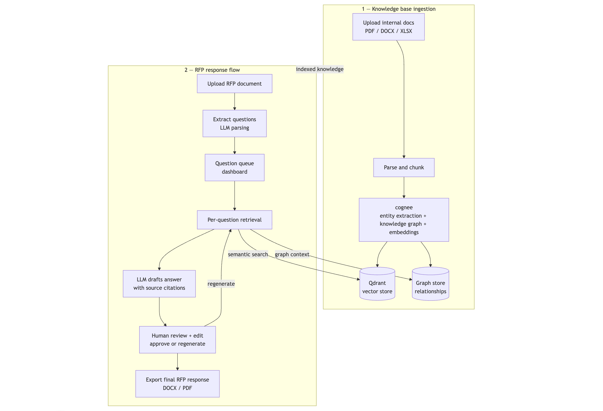

# RFP Response Generator

Full-stack application for uploading company knowledge, extracting questions
from incoming RFPs, generating grounded draft answers, and exporting a polished
DOCX response.



## Stack

- **Backend**: FastAPI (async), in-memory storage for PoC state
- **Knowledge processing**: Cognee with Qdrant Cloud. Qdrant for Vector search engine
- **LLM**: OpenAI `gpt-5.4-nano`
- **Frontend**: Next.js 14 App Router + TypeScript + Tailwind + TanStack Query v5
- **Export**: `python-docx`

## Prerequisites

- Python 3.11+
- Node.js 20+
- A Qdrant Cloud cluster (URL + API key)
- An OpenAI API key

## Quick Start

From the project root, copy the env templates and fill in your provider credentials:

```bash
cp backend/.env.example backend/.env
cp frontend/.env.example frontend/.env.local
```

Required values:

- `LLM_API_KEY`: OpenAI API key used for extraction, answer generation, and embeddings.
- `QDRANT_URL`: Qdrant Cloud cluster URL.
- `QDRANT_API_KEY`: Qdrant Cloud API key.

> Qdrant Cloud: https://cloud.qdrant.io/
> OpenAI API Key: https://platform.openai.com/

Optional values:

- `NEXT_PUBLIC_API_URL`: frontend API base URL. Defaults to `http://localhost:8000`.
- `LLM_MODEL`: OpenAI model for extraction and generation. Defaults to `gpt-5.4-nano`.

### 1. Backend

```bash
cd backend
python -m venv .venv
source .venv/bin/activate
pip install -r requirements.txt
python -m uvicorn app.main:app --reload --port 8000
```

Backend is reachable at http://localhost:8000 (docs at /docs).

### 2. Frontend

```bash
cd frontend
npm install
npm run dev
```

Open http://localhost:3000 -> auto-redirects to `/knowledge`.

## Workflow

1. **Knowledge** (`/knowledge`): drop PDF, DOCX, TXT, or Markdown company documents.
   The app processes them into a searchable company library for future answers.
2. **RFPs** (`/rfps`): create a project by uploading an RFP file. Questions are
   auto-extracted by `gpt-5.4-nano`.
3. **RFP Detail** (`/rfps/[id]`): generate answers per-question or all at once.
   Each answer is grounded in retrieved chunks and lists its sources. Edit,
   approve, then export as DOCX.

## Environment Variables

See `backend/.env.example` and `frontend/.env.example`. Backend reads from
`backend/.env`; frontend reads `frontend/.env.local` for `NEXT_PUBLIC_API_URL`.