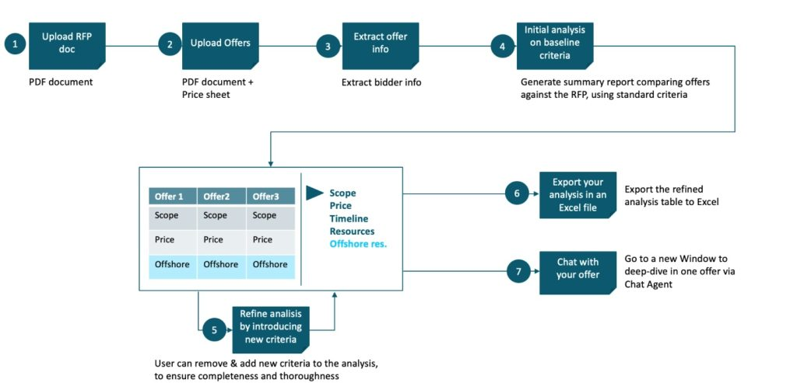
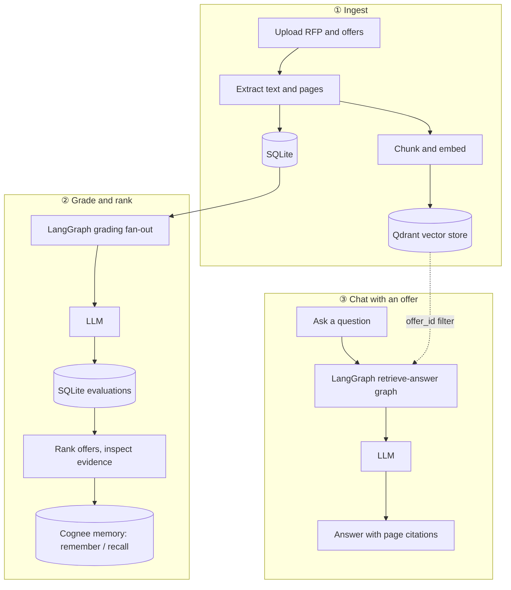
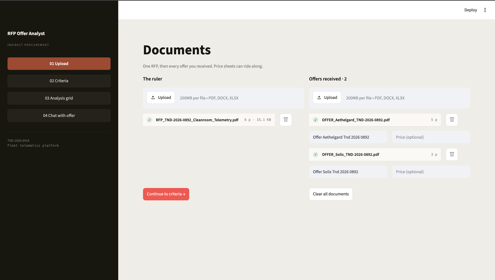
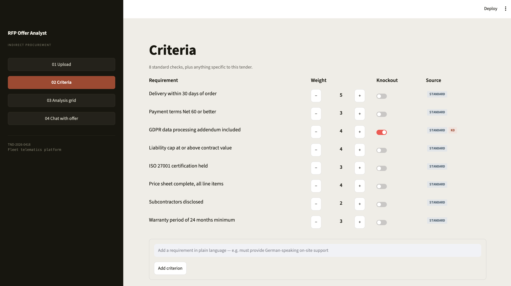
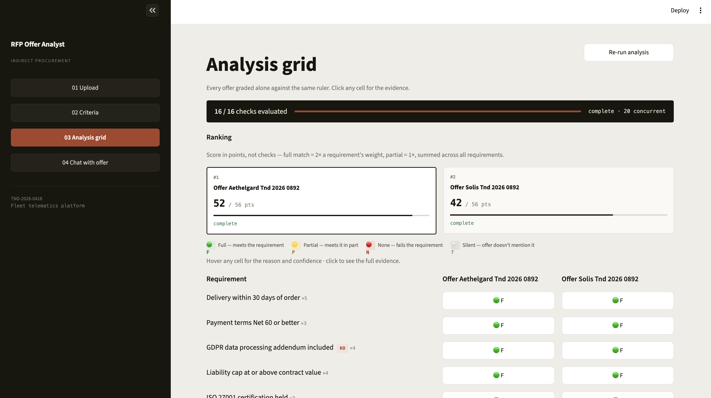
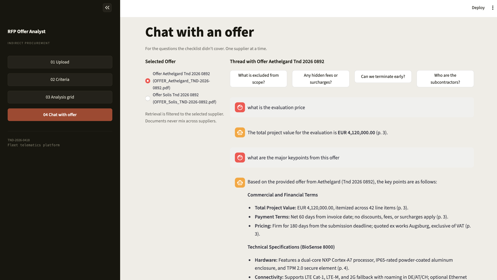

# RFP Offer Analyst

PoC application for evaluating supplier offers against one RFP. Upload the RFP and supplier offers, review or add criteria, run LLM-backed grading across every offer/criterion cell, rank suppliers, inspect evidence, and chat with an individual offer using payload-filtered vector retrieval.

## Motivation

This project draws inspiration from BMW Group's "Offer Analyst", a generative-AI solution built with AWS and BCG to modernize BMW's procurement offer-review process. Offer Analyst quickly revolutionized the traditional offer-review procedure, automating the extraction, comparison, and evaluation of supplier offers against RFP requirements, cutting a process that used to take days down to a matter of hours.

Reference: Revamping procurement operations with generative AI (AWS Industries Blog, with BCG)



## Stack

- **UI**: Streamlit 
- **Vector search**: Qdrant + FastEmbed, configured through. Get your Endpoint and API key: [cloud.qdrant.io](https://cloud.qdrant.io/)
- **Memory**: Cognee Cloud supplier/tender notes. Get your API Base URL and API key: [platform.cognee.ai](https://platform.cognee.ai/)
- **LLM**: Gemini. Get your API key: [aistudio.google.com](https://aistudio.google.com/)
- **Chat with Offer**: LangGraph and Qdrant

## Architecture



## UI Walkthrough

**01 Upload**: add the RFP and every supplier offer received against it, price sheets included.



**02 Criteria**: standard checks plus anything specific to the tender, with weights and knockout flags.



**03 Analysis grid**: every offer graded against the same criteria, ranked and scored, click any cell for evidence.



**04 Chat with offer**: ask a supplier's offer questions the checklist did not cover; retrieval stays filtered to that offer.



## Configuration

Copy `.env.example` to `.env` and fill in `GEMINI_API_KEY`, `QDRANT_URL`/`QDRANT_API_KEY`, and `COGNEE_ENDPOINT_URL`/`COGNEE_API_KEY`. Everything else in the file has a working default. All values are read by `config.py`.

```bash
cp .env.example .env
```

## Run

```bash
uv sync
uv run streamlit run app.py
```

Open [http://localhost:8501](http://localhost:8501).

## Workflow

1. **Upload**: Add one RFP and one or more supplier offers. PDF, DOCX, XLSX, and XLSM are supported.
2. **Prepare Retrieval**: Moving into Criteria, Analysis Grid, or Chat prepares Qdrant chunks for every uploaded offer. Existing indexed offers are skipped, new offers are added, and deleted offers are removed from Qdrant.
3. **Criteria**: Use the standard criteria, adjust weights and knockout flags, or add custom criteria.
4. **Analysis Grid**: Run grading, rank suppliers, inspect verdicts, reasons, quotes, page numbers, confidence, and memory notes. Supplier summaries are saved to Cognee after grading completes.
5. **Chat With Offer**: Ask questions against one supplier offer at a time. Chat uses LangGraph plus Qdrant retrieval only; Cognee is not used in the chat path. Qdrant search is always filtered by `offer_id`.

## Project Structure

```text
rfp-offer-analyst/
├── app.py          # Streamlit UI
├── config.py       # Env-backed LLM, embedding, vector, and Qdrant settings
├── client.py       # Cached Gemini, FastEmbed, and Qdrant clients
├── grade.py        # LangGraph fan-out grading
├── chat.py         # Offer Q&A over retrieved chunks
├── vector_store.py # Qdrant indexing and search
├── memory.py       # Cognee remember/recall wrapper
├── db.py           # SQLite schema and connection helper
├── utils.py        # Extraction, score calculation, and criteria seeding
├── context/        # Planning/design notes
├── fixtures/       # Sample RFP and supplier offer files
├── pyproject.toml
└── .env.example
```
